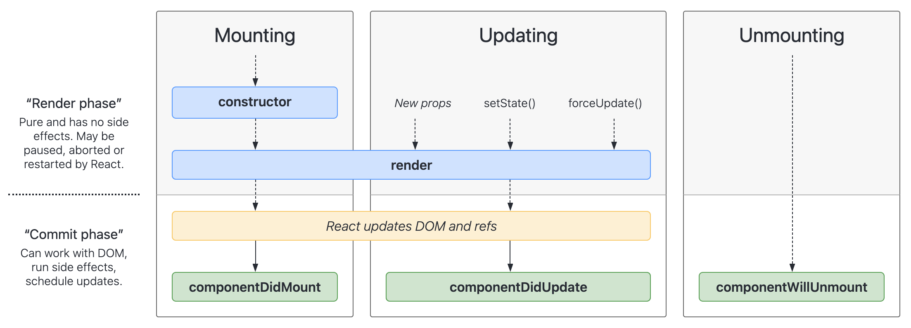
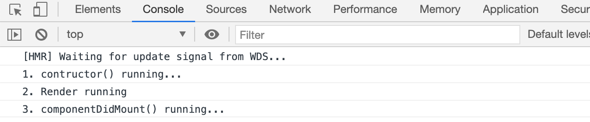
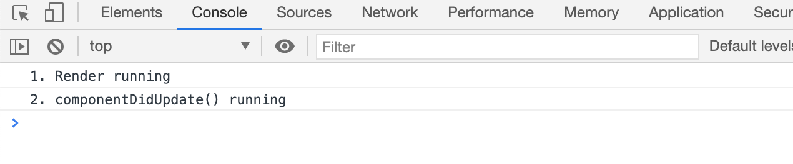
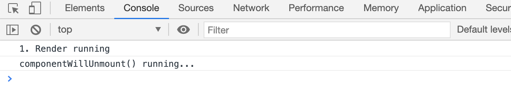

# Life Cycle React Toàn Tập

## Life Cycle Class



### Quá trình Mounting

-   **constructor()** là hàm được chạy đầu tiên khi mà class được khởi tạo. Hàm này dùng để khai báo thuộc tính của component và khai báo state của component đó. Lưu ý: Phải gọi super để tạo biến **_this_**
-   **render()** là hàm sẽ trả về JSX và render ra giao diện và tiến hành cập nhật DOM ảo sang DOM thật.
-   **componentDidMount()** là hàm sẽ chạy sau khi hàm render chạy nhưng chỉ chạy đúng 1 lần khi được mounting. Hàm này thường dùng để gọi API, biến đổi dữ liệu, cập nhật state,...) hoặc gửi tracking page view.

### Quá trình Updating

-   Quá trình này chỉ diễn ra khi có sự thay đổi của state hoặc props, nó sẽ chạy lại hàm **render()** để render.
-   Sau khi re-render lại nó sẽ chạy hàm **componentDidUpdate()**

### Quá trình Unmounting

-   Quá trình này chỉ diễn ra khi không render ra component nữa hoặc chuyển sang một trang khác.
-   Sau đó nó sẽ chạy hàm **componentWillUnmount()**. Hàm này thường dùng để clear interval hoặc setTimeout hoặc reset dữ liệu trên redux nếu cần.

> Quá trình mounting và unmounting chỉ diễn ra đúng 1 lần.

### Ví dụ về quá trình mounting

```js
import React, { PureComponent } from 'react';

export default class LifeCycleClass extends PureComponent {
    constructor(props) {
        super(props);
        console.log('1. contructor() running...');
    }

    componentDidMount() {
        console.log('3. componentDidMount() running...');
    }

    render() {
        console.log('2. Render running');
        return <h1>LifeCycleClass</h1>;
    }
}
```

Kết quả khi chạy



### Ví dụ về quá trình updating

```js
import React, { PureComponent } from 'react';

export default class LifeCycleClass extends PureComponent {
    constructor(props) {
        super(props);
        this.state = {
            counter: 0,
        };
    }

    componentDidUpdate() {
        console.log('2. componentDidUpdate() running');
    }

    render() {
        console.log('1. Render running');
        return (
            <div>
                <h1>LifeCycleClass: {this.state.counter}</h1>
                <button
                    onClick={() => {
                        this.setState({
                            counter: this.state.counter + 1,
                        });
                    }}
                >
                    Click counter
                </button>
            </div>
        );
    }
}
```

Khi click vào button thì thay đổi state, lúc này componentDidUpdate() sẽ được chạy.



### Ví dụ về quá trình unmounting

```js
import React, { PureComponent } from 'react';
import DisplayItem from './DisplayItem';

export default class LifeCycleClass extends PureComponent {
    constructor(props) {
        super(props);
        this.state = {
            display: false,
        };
    }

    render() {
        console.log('1. Render running');
        return (
            <div>
                <h1>LifeCycleClass: {this.state.counter}</h1>

                {this.state.display && <DisplayItem />}

                <button
                    onClick={() => {
                        this.setState({
                            display: !this.state.display,
                        });
                    }}
                >
                    Display
                </button>
            </div>
        );
    }
}
```

```js
import React, { PureComponent } from 'react';

export default class DisplayItem extends PureComponent {
    componentWillUnmount() {
        console.log('componentWillUnmount() running...');
    }

    render() {
        return <h1>DisplayItem</h1>;
    }
}
```

Khi click vào button Display thì nó sẽ hiện hoặc ẩn. Nếu là ẩn (false) thì nó sẽ remove khỏi DOM trong App.js. Lúc này nó sẽ chạy làm componentWillUnmount() trong DisplayItem.jsx.



## Life Cycle Hooks

useEffect là một hàm cơ bản trong React Hook. Gồm có các trường hợp sau:

### useEffect tham số là callback

```js
import React, { useState, useEffect } from 'react';

const LifeCycleFunction = () => {
    const [counter, setCounter] = useState(0);

    useEffect(() => {
        // 3. componentDidMount và componentDidUpdate
        console.log('useEffect() running');
    });

    console.log('render() running...');
    return (
        <>
            <h1>Lifecycle Hooks</h1>
            <h2>Couter: {counter}</h2>
            <button
                onClick={() => {
                    setCounter(counter + 1);
                }}
            >
                Counter
            </button>
        </>
    ); // Tương ứng với render
};

export default LifeCycleFunction;
```

Đầu tiên nó sẽ chạy render() và useEffect() (useEffect lúc này tương ứng với componentDidMount). Sau mỗi lần click vào button thì state sẽ thay đổi. Vì vậy nó sẽ render lại. Mỗi lần render lại nó sẽ chạy useEffect() (useEffect lúc này tương ứng với componentDidUpdate).

### useEffect có 2 tham số (callBack và array empty)

```js
import React, { useState, useEffect } from 'react';

const LifeCycleFunction = () => {
    const [counter, setCounter] = useState(0);

    useEffect(() => {
        console.log('useEffect() 1 running');
    });

    useEffect(() => {
        console.log('useEffect() 2 running');
    }, []);

    console.log('render() running...');
    return (
        <>
            <h1>Lifecycle Hooks</h1>
            <h2>Couter: {counter}</h2>
            <button
                onClick={() => {
                    setCounter(counter + 1);
                }}
            >
                Counter
            </button>
        </>
    ); // Tương ứng với render
};

export default LifeCycleFunction;
```

Với useEffect có 2 tham số, thì nó sẽ chạy đúng 1 lần khi render lần đầu tiên hoặc reload lại trang. Khi có sự thay đổi state nó vẫn không chạy lại. (Tương ứng với componentDidMount).

### useEffect có 2 tham số (callBack và array list props or state)

```js
import React, { useState, useEffect } from 'react';
import DisplayItem from './DisplayItem';

const LifeCycleFunction = () => {
    const [counter, setCounter] = useState(0);
    const [isVisible, setIsVisible] = useState(false);

    useEffect(() => {
        console.log('useEffect() counter running');
    }, [counter]);

    useEffect(() => {
        console.log('useEffect() isVisible running');
    }, [isVisible]);

    console.log('render() running...');
    return (
        <>
            <h1>Lifecycle Hooks</h1>
            <h2>Couter: {counter}</h2>
            <button
                onClick={() => {
                    setCounter(counter + 1);
                }}
            >
                Counter
            </button>
            <button
                onClick={() => {
                    setIsVisible(!isVisible);
                }}
            >
                Toggle Button
            </button>
            {isVisible && <DisplayItem />}
        </>
    ); // Tương ứng với render
};

export default LifeCycleFunction;
```

Với useEffect có 2 tham số, tham số thứ 2 là list props hoặc state. Nó sẽ chạy lần đầu tiên và khi có sự thay đổi của props hoặc state được truyền vào thì mới được chạy. Ví dụ: khi counter thay đổi thì useEffect counter sẽ được chạy hoặc khi isVisible thay đổi thì useEffect có state được truyền vào list array sẽ được chạy.

### useEffect có tham số (callBack)

```js
import React, { useEffect } from 'react';

const DisplayItem = () => {
    useEffect(() => {
        console.log('useEffect DisplayItem');
        return () => console.log('useEffect unmounting...');
    });

    return <h1>DisplayItem</h1>;
};

export default DisplayItem;
```

useEffect callBack truyền vào bên trong hàm sẽ được chạy khi mounting và nếu trả về 1 function thì sẽ tương ứng với componentWillUnmount.
